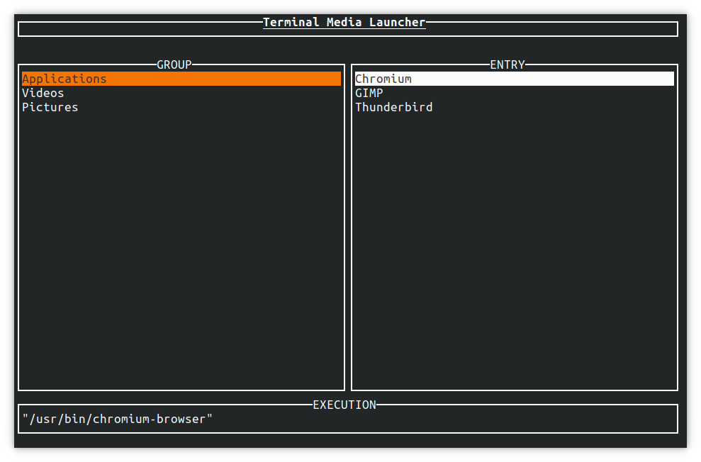
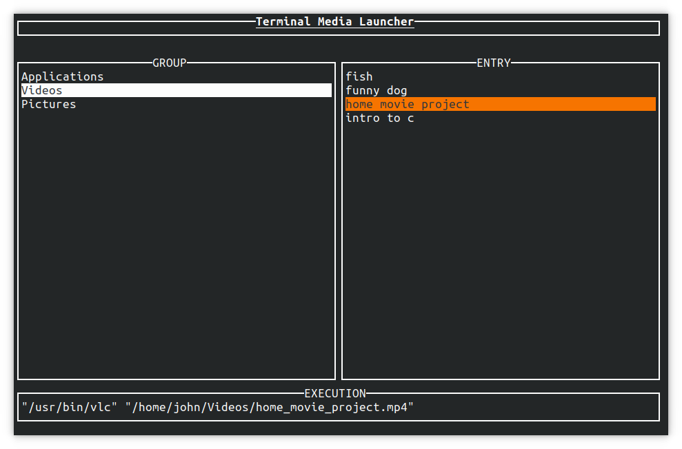

## Introduction

**Terminal Media Launcher** is a command line utility to help streamline launching applications and other media. The goal of tml is to provide a fast, minimal, command line frontend with a Unix-like approach to setup and configuration. The program looks for a configuration file listing different groups of media and creates an ncurses menu from which to select from. If a configuration file is found, the program will draw two columns: one for groups, and one for entries. At the bottom of the window, a preview of the command execution is displayed.

## Compiling and Running

For Windows instructions, see [here](windows_compile_instructions.md)

tml can be compiled on any system with make, gcc, and the ncurses library (libncurses-dev) installed. It can be compiled and installed on any Linux distribution, and can also be compiled and run on Windows 10. To compile and run tml:

1. Clone the repository
2. Run `make` in the directory the repository was cloned into. This will create a file called `tml`
3. `./tml` to run the program

Note that tml will not run until you have created a configuration file.

### Installation

tml can be installed on Linux by running:

```
sudo make install
```

This will install `tml` to `/usr/local/bin/tml` as well as man pages `tml` and `tml-config`.
To uninstall these files:

```
sudo make uninstall
```

### Create Desktop Entry

If tml is installed (see above), a Desktop Entry can be created on Linux by running:

```
sudo make desktop-entry
```

This will create a desktop entry at `/usr/local/share/applications/tml.desktop`.

## Screenshots




## Configuration File

By default, tml searches in the following order for a configuration file:

### Linux

1. `$HOME/.config/tml/config`
2. `$HOME/.tml/config`

### Windows

1. `%APPDATA%\tml\config`

A different configuration file location can also be specified with the `-c` flag:

```
tml -c /path/to/config
```

For Documentation of the configuration file, see [tml-config](tml-config.md).
For a help message and list of flags, `tml --help`.
If you installed tml, you can also consult **tml**(1) and **tml-config**(5).
